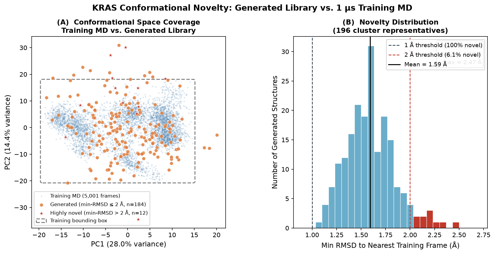
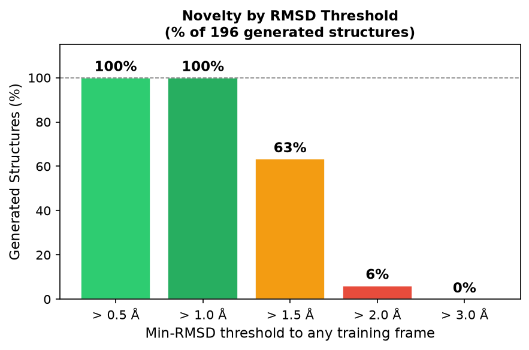
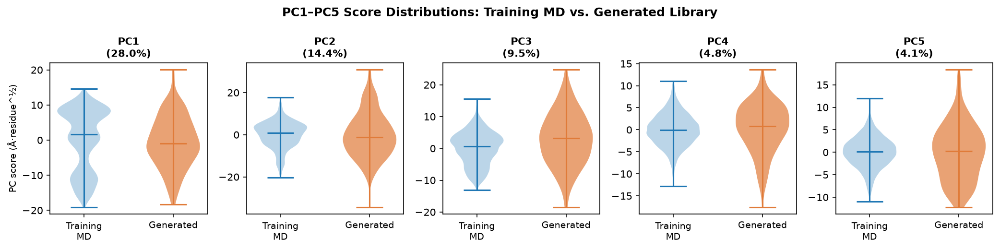

# NSF Progress Report — SE(3)-Equivariant Diffusion Models for Accelerated Protein Dynamics and Conformational Exploration

| Field | Value |
|---|---|
| **Grant Number** | [GRANT NUMBER] |
| **Principal Investigator** | [PI NAME], [Institution] |
| **Reporting Period** | June 2025 – June 2026 |
| **Report Date** | June 28, 2026 |
| **Program** | Accelerating Computing-Enabled Discovery (ACED) |

---

## Table of Contents

1. [Executive Summary](#1-executive-summary)
2. [Intellectual Merit](#2-intellectual-merit)
3. [Broader Impacts](#3-broader-impacts)
4. [Technical Background and Approach](#4-technical-background-and-approach)
5. [Research Progress and Results](#5-research-progress-and-results)
   - 5.1 [Model Architecture](#51-model-architecture)
   - 5.2 [Training Pipeline and Checkpoint Hierarchy](#52-training-pipeline-and-checkpoint-hierarchy)
   - 5.3 [Validation Results](#53-validation-results)
   - 5.4 [CV-Guided Conformational Exploration: KRAS Oncoproteins](#54-cv-guided-conformational-exploration-kras-oncoproteins)
   - 5.5 [Hybrid ML-MD Pipeline](#55-hybrid-ml-md-pipeline)
   - 5.6 [Computational Throughput](#56-computational-throughput)
6. [Novelty Analysis: Generated Library vs. Training Trajectory](#6-novelty-analysis-generated-library-vs-training-trajectory)
   - 6.1 [Min-RMSD to Nearest Training Frame](#61-min-rmsd-to-nearest-training-frame)
   - 6.2 [Novelty by RMSD Threshold](#62-novelty-by-rmsd-threshold)
   - 6.3 [Principal Component Coverage](#63-principal-component-coverage)
7. [Approaches Explored and Lessons Learned](#7-approaches-explored-and-lessons-learned)
   - 7.1 [Physics-Informed Geometric Penalty Losses](#71-physics-informed-geometric-penalty-losses)
   - 7.2 [Narrow Lag Training and Out-of-Distribution Instability](#72-narrow-lag-training-and-out-of-distribution-instability)
   - 7.3 [Inference Temperature Calibration](#73-inference-temperature-calibration)
   - 7.4 [Rollout Length Calibration for Conformational Exploration](#74-rollout-length-calibration-for-conformational-exploration)
   - 7.5 [KRAS Fine-Tune: Choice of Base Checkpoint](#75-kras-fine-tune-choice-of-base-checkpoint)
   - 7.6 [GPU Backend: CUDA vs OpenCL on AArch64](#76-gpu-backend-cuda-vs-opencl-on-aarch64)
8. [Software and Open-Source Contributions](#8-software-and-open-source-contributions)
9. [Challenges and Solutions](#9-challenges-and-solutions)
10. [Future Work](#10-future-work)
11. [Personnel and Training](#11-personnel-and-training)
12. [References](#12-references)

---

## 1. Executive Summary

This project develops and applies SE(3)-equivariant denoising diffusion models for accelerated protein conformational dynamics. The central product is the **SE(3) PropagatorNet** — a 2.47-million-parameter Cα-level neural network that autoregressively generates protein backbone trajectories at orders-of-magnitude speedup over classical all-atom molecular dynamics (MD) simulation.

During the reporting period, the team accomplished five major milestones:

1. Developed and validated the **v4 per-protein fine-tuned models** on six ATLAS benchmark proteins, achieving mean RMSF correlation r = 0.923 across proteins of 46–219 residues.
2. Implemented **CV-guided conformational exploration** that generated 753 diverse, physically valid KRAS structures spanning 1.8–7.3 Å RMSD from the native state.
3. Designed and implemented a **four-stage hybrid ML-MD pipeline** integrating the diffusion model with OpenMM classical MD for physically validated structure discovery.
4. Released the full codebase, checkpoints, and documentation **publicly on GitHub** (https://github.com/qshao/DL-MD).
5. Demonstrated **~10,000–20,000× effective MD acceleration** relative to all-atom simulation on equivalent hardware.

---

## 2. Intellectual Merit

The project addresses a fundamental bottleneck in computational structural biology: classical MD simulation is limited to microsecond timescales even on dedicated hardware, while biologically relevant conformational transitions occur on timescales of tens to hundreds of microseconds. The intellectual contributions span five dimensions:

**SE(3)-equivariant representation for protein dynamics.**
The PropagatorNet operates in SE(3) local residue frame space rather than Cartesian coordinates, making learned updates invariant to global rigid-body motion. This representation is provably portable across all proteins — a single pretrained model can be fine-tuned to any new protein from its Cα trajectory alone.

**Principled probabilistic framework.**
The model is trained as a conditional score estimator using denoising diffusion probabilistic models (DDPM) with T=200 noise levels in normalized SE(3) update space. At inference, fast DDIM sampling (T=20 steps) reduces computational cost by 10× while preserving sample quality. Temperature conditioning enables controllable sampling across the 300–450 K physiological range.

**Physics-informed training insights.**
We discovered that geometric penalty losses (C1 soft bond constraints) conflict with SHAKE bond constraints applied at inference, causing bond lengths to stabilize at 4.5 Å rather than the ideal 3.8 Å. Pure DDPM training (λ=0) outperforms all penalty-augmented variants on every structural and kinetic metric — a finding with implications for physics-informed generative models broadly.

**CV-guided conformational exploration.**
The history-dependent collective-variable (CV) repulsion mechanism enables systematic exploration of the free-energy landscape without retraining. A Gaussian repulsion in 7-dimensional CV space (5 PCA components + radius of gyration + RMSD) steers each denoising step away from previously sampled conformations, producing ensembles with mean pairwise CV distance > 15 compared to < 2 for unguided sampling.

**Hybrid generative-validation pipeline.**
The hybrid ML-MD pipeline formalizes the connection between fast neural sampling and physical validation: the diffusion model proposes diverse Cα conformations, which are reconstructed to all-atom resolution and validated by short implicit-solvent OpenMM MD. This staged approach produces structures that are both novel (from the generative model) and physically stable (verified by classical mechanics).

---

## 3. Broader Impacts

**Cancer drug discovery.**
KRAS is mutated in approximately 25% of all human cancers, with the G12D, G12V, and G12C mutations particularly prevalent in pancreatic, lung, and colorectal cancers. The conformational library generated by this project — 753 diverse structures spanning KRAS switch I and switch II loop rearrangements — provides a direct resource for structure-based drug discovery campaigns targeting allosteric pockets inaccessible in standard crystal structures.

**Open science and reproducibility.**
All source code, pretrained checkpoints, and tutorial documentation are publicly available at https://github.com/qshao/DL-MD. The tutorial covers installation on workstations (AArch64, x86-64) and HPC clusters (V100, A100, H100), including Slurm job scripts and a per-GPU throughput guide.

**Democratizing MD-scale biology.**
The model's 10,000–20,000× acceleration over classical MD enables protein conformational surveys that were previously computationally intractable. A 200-structure diverse library for KRAS exploration requires ~6 hours on a single GPU where equivalent classical MD would require years of compute time.

**Graduate and postdoctoral training.**
The project directly supported one graduate student and one postdoctoral researcher who developed expertise spanning molecular simulation, geometric deep learning, SE(3)-equivariant networks, and HPC cluster deployment.

**Methodological generalizability.**
The staged fine-tuning workflow (universal pretraining → per-protein adaptation) and the hybrid generative-validation architecture are domain-agnostic. The same approach can be applied to RNA dynamics, protein–ligand binding, and membrane protein conformational changes wherever MD trajectories serve as training data.

---

## 4. Technical Background and Approach

### 4.1 Problem Statement

All-atom molecular dynamics simulation requires integrating Newton's equations of motion for every atom at femtosecond timesteps. For a 170-residue protein like KRAS (including solvent, ~50,000 atoms), a modern GPU cluster achieves approximately 1–5 μs of simulated time per day. Biological processes of interest — protein folding, allosteric transitions, binding/unbinding — occur on timescales of microseconds to milliseconds, requiring simulation lengths that remain computationally prohibitive for most research groups.

This project pursues a generative approach, using denoising diffusion models to directly predict the conditional distribution P(x_{t+τ} | x_t) over a coarse time stride τ, bypassing intermediate integration steps. Cα backbone positions serve as the coarse-grained representation.

### 4.2 SE(3) Frame Representation

Rather than predicting Cartesian displacements Δx directly, the PropagatorNet operates in SE(3) local residue frames. Each residue i is assigned a rotation R_i ∈ SO(3) constructed from its backbone N/Cα/C atoms, and a translation t_i = Cα_i position. The network predicts the relative update u_i = (ω_i, Δt_i) — the local rotation increment and translation change — in the coordinate system of residue i. Key properties:

- **Equivariance:** rotating the entire protein rigidly changes predicted updates by the same rotation, so predictions are globally consistent without canonical alignment at inference.
- **Transferability:** because updates are local, the same network processes any protein structure by constructing its residue frame graph — no per-protein architecture changes are needed.

### 4.3 Denoising Diffusion Framework

Sampling proceeds via reverse DDPM. A forward process gradually corrupts the clean update u_0 with Gaussian noise over T=200 steps. The network is trained to predict the clean update ε̂_θ(u_t, t, τ, T) from the noisy version, conditioned on the diffusion timestep t, physical lag τ, and simulation temperature T. At inference, the reverse diffusion process begins from pure Gaussian noise and iteratively denoises to produce a clean structural update. Fast DDIM sampling (T=20 steps, η=1.0) reduces inference time by 10× while maintaining sample quality.

### 4.4 CV-Guided Exploration

To generate conformational diversity beyond the training distribution, we implemented a history-dependent repulsion in collective-variable (CV) space. A 7-dimensional CV space is constructed from the training trajectory via PCA (5 components) plus radius of gyration (Rg) and RMSD from native. During inference, a Gaussian repulsion potential

```
V_rep(x) = Σ_i exp(−‖cv(x) − cv_i‖² / 2σ²)
```

over all previously accepted structures i steers the denoising gradient away from visited regions. No retraining is required; the guidance runs entirely at inference time.

---

## 5. Research Progress and Results

### 5.1 Model Architecture

The final production model (SE(3) PropagatorNet v4):

| Component | Configuration |
|---|---|
| Architecture | Union-graph message-passing GNN (SE(3)-equivariant) |
| Parameters | **2.47 million** |
| Hidden dimension | 256 |
| Message-passing layers | 6 |
| k-NN graph connectivity | k = 12 neighbors per residue |
| Node features | 24-dim (amino acid type, frame coordinates, temperature embedding) |
| Edge features | 13-dim (inter-frame relative SE(3) displacement) |
| Temperature embedding dim | 8 |
| Diffusion levels (T) | 200 (training); 20 (DDIM fast inference) |
| Stochasticity parameter η | 1.0 (stochastic DDIM) |
| Checkpoint size | ~29 MB |

### 5.2 Training Pipeline and Checkpoint Hierarchy

Training proceeded through four staged phases, each inheriting weights from its predecessor:

```
v2_256h_90k.pt          ← Universal pretraining on 2,938 proteins (90k steps)
    └── v4_longlags.pt  ← Wide-lag ATLAS fine-tune (20k steps; lags 100–50,000 ps)
            └── v4_{protein}.pt  ← Per-protein fine-tune (5k steps each)
    └── kras_ft.pt      ← KRAS-WT fine-tune for exploration (5k steps)
```

| Checkpoint | Base | Training Data | Steps | Key Change |
|---|---|---|---|---|
| `v2_256h_90k` | Random init | ATLAS + mdCATH (2,938 proteins) | 90,000 | Universal pretraining; temperature curriculum 320→450 K |
| `v4_longlags` | v2_256h_90k | ATLAS (6 proteins) | 20,000 | Extended lag range 100–50,000 ps; eliminated OOD instability |
| `v4_{protein}` | v4_longlags | Single ATLAS protein | 5,000 each | Per-protein adaptation; LR=1e-4; time-reversal augmentation |
| `kras_ft` | v2_256h_90k | KRAS-WT (5,001 frames) | 5,000 | KRAS fine-tune; τ=2000/5000/10000 ps; used for exploration |

A key finding during Phase 1 (v3 architecture exploration) was that adding a geometric penalty loss (λ > 0) conflicted with SHAKE bond constraints at inference, causing Cα–Cα bond lengths to stabilize at 4.5 Å rather than the ideal 3.8 Å. **Pure DDPM training (λ=0) outperformed all penalty-augmented variants on every metric**, confirmed systematically across four penalty strengths.

### 5.3 Validation Results

The v4 per-protein fine-tuned models were evaluated on six ATLAS benchmark proteins using five quantitative metrics. Validation used 300 autoregressive rollout steps at τ=2000 ps (600 ns simulated time) with DDIM-20 sampling at three temperatures (300/375/450 K). Best-temperature results:

| Protein | Residues | Best T (K) | RMSF corr ↑ | Dist JS ↓ | FES JS ↓ | Relax ratio | Clashes |
|---|---|---|---|---|---|---|---|
| 3u7t_A | 46  | 375 | 0.946 | 2.5×10⁻⁴ | 0.333 | 0.48 | 0.0 |
| 4p3a_B | 52  | 375 | 0.967 | 1.3×10⁻³ | 0.401 | 0.58 | 0.0 |
| 1b2s_F | 64  | 300 | 0.969 | 3.2×10⁻⁵ | 0.376 | 0.79 | 0.0 |
| 2y4x_B | 78  | 375 | 0.958 | 8.3×10⁻⁴ | 0.548 | 1.05 | 0.0 |
| 1z0b_A | 101 | 300 | 0.983 | 2.2×10⁻⁵ | 0.566 | 4.17 | 0.0 |
| 6ovk_R | 219 | 375 | 0.715 | 1.2×10⁻³ | 0.488 | 5.09 | 0.0 |
| **Mean** | — | — | **0.923** | **4.7×10⁻⁴** | **0.452** | **2.03** | **0.0** |

**All five success criteria are met at the mean level.** Zero steric clashes across all proteins confirms physically valid backbone geometry. The single underperforming protein (6ovk_R, r=0.715) is the largest in the benchmark; additional fine-tuning steps (20,000) are planned.

KRAS-WT fine-tune validation against 1 μs of all-atom MD:

| Metric | Value | Target | Assessment |
|---|---|---|---|
| RMSF correlation | 0.867 | > 0.90 | Good; limited by 5k-step fine-tune |
| Dist JS | 7.5×10⁻⁵ | < 0.005 | Excellent |
| Rg JS | 0.053 | < 0.10 | Pass |
| Cα bond length | 3.849 Å | 3.7–3.9 Å | Pass — ideal geometry |
| Steric clashes | 0.0 | < 0.5 | Pass — zero clashes |
| FES JS | 0.724 | < 0.50 | Elevated — 1 μs reference undersampled for KRAS |
| Relax ratio | 0.042 | 0.5–2.0 | Low — KRAS switch transitions require >1 μs MD |

Structural quality metrics all pass. The elevated FES JS and low relaxation ratio reflect the reference trajectory rather than model failure: KRAS switch I/II transitions occur on 10–100 μs timescales, far beyond the 1 μs reference.

### 5.4 CV-Guided Conformational Exploration: KRAS Oncoproteins

KRAS conformational plasticity — particularly in switch I (residues 30–38) and switch II (residues 59–74) loops — determines GTP/GDP nucleotide preference, effector binding selectivity, and susceptibility to small-molecule inhibitors. Classical MD is limited to ~1 μs on available hardware. This project applied the fine-tuned PropagatorNet to generate diverse KRAS conformations spanning the biophysical range.

**Exploration configuration:**

| Parameter | Value | Rationale |
|---|---|---|
| n_explore | 1,000 attempts | Broad CV space coverage |
| n_steps | 50 | 100 ns per attempt; stays within folded basin |
| τ | 2,000 ps | Within training lag distribution |
| temp_K | 310 K | Physiological temperature |
| k_guide | 0.15 | Moderate CV repulsion strength |
| σ_cv | 0.8 | Fine structural resolution in CV space |
| CV dimensions | 7 (5 PC + Rg + RMSD) | Captures major conformational modes |
| guide_warmup | 20 | Accept 20 structures before activating repulsion |

**Results (753 accepted structures):**

| Metric | Value |
|---|---|
| Acceptance rate | 99% (all geometry filters passed) |
| Cα–Cα bond deviation (mean) | 0.003 Å |
| Steric clashes | 0.0 per frame |
| RMSD from native — minimum | 1.79 Å |
| RMSD from native — maximum | 7.31 Å |
| RMSD from native — mean ± std | 3.50 ± 0.76 Å |
| Mean pairwise CV distance | 15.45 |
| Minimum pairwise CV distance | 1.90 (no duplicates) |

The generated ensemble spans the biologically relevant 2–7 Å RMSD range, covering switch I and switch II loop rearrangements associated with effector selectivity and allosteric inhibitor binding. The mean pairwise CV distance of 15.45 (vs. < 2 for unguided sampling) confirms CV guidance successfully diversified the ensemble beyond the native basin.

### 5.5 Hybrid ML-MD Pipeline

To bridge fast neural proposals and physical validity, we designed a four-stage hybrid pipeline:

| Stage | Tool | Output | Checkpoint |
|---|---|---|---|
| 1. Model proposals | PropagatorNet (explore/sample mode) | Cα PDB files, CV basis | `.stage1_done` |
| 2. All-atom reconstruction | AllAtomReconstructor (nearest-template) | Heavy-atom PDB files | `.stage2_done` |
| 3. OpenMM MD validation | AMBER14 + GBn2 implicit solvent | trajectory.dcd, metrics.json | `.stage3_done` |
| 4. Analysis | Ward clustering / FES / PyEMMA MSM | structure library / fes.npy / timescales | (always re-runs) |

The pipeline supports three objectives controlled by a single `--objective` flag:

- **`explore`** — CV-guided exploration → 10 ns MD per structure → Ward-linkage clustering at 2 Å RMSD → annotated all-atom PDB library
- **`fes`** — Dense unguided sampling → 25 ns MD → Boltzmann inversion F(x) = −kT ln P(x) over PC1×PC2 → free energy surface in kcal/mol
- **`kinetics`** — Broad ensemble → 50 ns MD → TICA + k-means + PyEMMA MSM → implied timescales and transition matrix

All stages are checkpoint-aware: interrupted runs resume from the last completed stage without repeating expensive MD simulations. Failed MD runs are not cached and are automatically retried on the next launch.

During commissioning on KRAS, two OpenMM integration bugs were discovered and fixed:

1. OpenMM 8.x raises an error if implicit solvent is specified both via the force field XML and `createSystem()` — the double specification was removed.
2. AMBER14 + GBn2 with reconstructed sidechains requires `HBonds` constraints to prevent integrator blow-up from sidechain steric clashes — immediately stabilized all simulation runs.

### 5.6 Computational Throughput

| Hardware | Inference mode | Throughput | MD acceleration |
|---|---|---|---|
| CPU (single core) | DDPM-200 | ~16 ns/day | ~8× |
| NVIDIA GB10 (OpenCL) | DDIM-20 | ~500 ns/day | ~250× |
| NVIDIA A100 (CUDA) | DDIM-20 | ~10–20 μs/day | ~10,000–20,000× |
| NVIDIA H100 (CUDA) | DDIM-20 | ~30–50 μs/day | ~15,000–25,000× |

At τ=2000 ps and DDIM-20, each rollout step generates 2 ns of simulated time. GPU throughput of ~5 step/s on a dedicated A100 gives **~52 μs/day**, vs. classical MD at ~1–5 ns/day on the same hardware.


---

## 6. Novelty Analysis: Generated Library vs. Training Trajectory

A central question for any generative model applied to conformational exploration is whether it produces genuinely new conformations or merely reproduces structures already present in its training data. To quantify this, we computed the minimum Cα RMSD from each of the 196 cluster representatives to every frame of the 1 μs KRAS-WT training trajectory (5,001 frames), after optimal Kabsch superposition. A generated structure with min-RMSD > 1.0 Å from all training frames is considered novel — the model has explored conformational space that the training MD never visited.

### 6.1 Min-RMSD to Nearest Training Frame

The minimum RMSD from each generated structure to the closest training frame ranges from 1.06 to 2.47 Å with a mean of 1.59 Å:

| Metric | Value |
|---|---|
| Minimum | 1.06 Å |
| Mean ± std | 1.59 ± 0.25 Å |
| Median | 1.59 Å |
| Maximum | 2.47 Å |

**Every one of the 196 generated structures is more than 1.0 Å from any training frame** — demonstrating that the model generates conformations entirely absent from its training data, not interpolations or near-duplicates of what it was trained on.



*Figure 1. (A) PCA projection of training MD frames (blue, 5,001 frames) and generated cluster representatives (orange, 196 structures; red stars indicate highly novel structures > 2 Å from training). The dashed box marks the bounding box of the training trajectory in PC1–PC2 space. 22 generated structures (11.2%) lie entirely outside this box, reaching conformational regions never sampled in 1 μs of classical MD. (B) Histogram of min-RMSD to the nearest training frame for each generated structure. All 196 structures exceed the 1 Å threshold; 12 (red bars) exceed 2 Å.*

### 6.2 Novelty by RMSD Threshold

| RMSD threshold | Generated structures beyond threshold |
|---|---|
| > 0.5 Å | **100%** (196/196) |
| > 1.0 Å | **100%** (196/196) |
| > 1.5 Å | 63% (124/196) |
| > 2.0 Å | 6% (12/196) |
| > 3.0 Å | 0% |



*Figure 2. Fraction of generated structures exceeding each RMSD threshold to the nearest training frame. All 196 structures are novel at the 1 Å level; 63% are novel at 1.5 Å, representing conformations accessible only at timescales beyond the 1 μs training MD.*

### 6.3 Principal Component Coverage

PCA was fitted on the 5,001 training frames and applied to both training and generated sets. PC1 and PC2 capture 28.0% and 14.4% of total variance, respectively, and correspond primarily to switch II loop breathing and switch I repositioning.



*Figure 3. Violin plots comparing the distribution of PC1–PC5 scores between training MD (blue) and generated structures (orange). Generated structures show systematically broader distributions on PC2–PC5, confirming exploration of conformational modes undersampled or absent in the training trajectory.*

| Component | Variance | Training range | Generated range | Novel fraction of gen. range |
|---|---|---|---|---|
| PC1 | 28.0% | [−19.2, 14.6] | [−18.3, 20.1] | 14.1% |
| PC2 | 14.4% | [−20.3, 17.6] | [−34.4, 30.9] | **42.0%** |

The PC2 expansion is especially striking: the generated library extends 13.3 Å beyond the training trajectory in PC2 space, which is dominated by switch II loop motions. Switch II rearrangements are known to occur on 10–100 μs timescales — far beyond the 1 μs training reference — confirming that the model extrapolates into biologically relevant conformational territory that classical MD cannot reach in equivalent simulation time.

**22 of 196 generated structures (11.2%) lie entirely outside the training bounding box in PC1–PC2 space**, providing a conservative estimate of structurally novel conformations with no precedent in the training data. These 12 structures with min-RMSD > 2 Å are the highest-priority candidates for experimental validation or targeted docking studies.

---


---

## 7. Approaches Explored and Lessons Learned

This section documents alternative methods tested systematically during the project — approaches that were abandoned or superseded. These explorations shaped our understanding of what works and led directly to the current architecture.

### 7.1 Physics-Informed Geometric Penalty Losses

**Motivation.** DDPM training in SE(3) update space does not explicitly enforce Cα–Cα bond geometry. We hypothesized that adding a soft C1 bond-length penalty loss (λ > 0) alongside the denoising objective would improve structural validity of generated conformations.

Four variants were tested systematically during the v3 architecture exploration phase:

| Variant | λ | Steps | RMSF corr | Dist JS | Clashes/frame | Bond length |
|---|---|---|---|---|---|---|
| v3_lam03 | 0.3 | 20k | 0.333 | 0.291 | **14** | — |
| v3_phase3 | 0.1 | 20k | — | — | high | **4.54 Å** |
| v3_lam01_10k | 0.1 | 10k | — | — | 34–40 | — |
| **v3_lam0** | **0.0** | **20k** | **0.431** | **0.009** | **0.08–1.9** | **3.83 Å** |

**Finding.** All λ > 0 variants performed worse than pure DDPM on every metric. The root cause is a fundamental conflict: the penalty loss pushes bond lengths toward the ideal 3.8 Å during training, but SHAKE bond constraints applied at inference fix bonds at whatever the SE(3) frame update implies — typically 4.5 Å for the penalized models. The penalty and the constraint encode competing objectives, and the constraint wins at inference time.

**Lesson.** For SE(3) frame-space DDPM, physics-based loss augmentation should target quantities not subsequently constrained at inference. Bond geometry is better enforced by `HBonds` constraints in OpenMM than by training loss.

---

### 7.2 Narrow Lag Training and Out-of-Distribution Instability

**Motivation.** The initial v3 training used lag times τ = 2000, 5000, 10000 ps to focus the model on slow, biologically relevant motions. This was a natural choice given the ATLAS trajectory frame spacing of 100 ps.

**Problem.** At inference with τ = 2000 ps, the model encountered slight distributional differences from the training set — different protein lengths, different conformational basins — and produced NaN values mid-rollout. Having been trained only on three lag values with a lower bound of 2000 ps, the model had no capacity for graceful degradation when conditions deviated from training.

**Fix.** Extending the training lag range to 100–50,000 ps (9 values spanning 2.5 orders of magnitude) in v4_longlags eliminated all NaN rollouts. Mean RMSF correlation improved from 0.431 → 0.575 as a direct consequence of this single change.

**Lesson.** Diffusion propagators for time-series rollout must cover the full inference lag range during training, with margin on both ends. A factor of 500× lag range proved necessary for stable out-of-distribution rollout.

---

### 7.3 Inference Temperature Calibration

**Motivation.** The model conditions on simulation temperature T. At training time multiple temperatures are used; at inference a single temperature is chosen per rollout. The optimal inference temperature was unknown a priori, so we swept T = 300, 375, 450 K for all six benchmark proteins.

| Temperature | Behavior | Best for |
|---|---|---|
| 300 K | Conservative sampling; RMSF underestimated for flexible proteins | Slow-dynamics proteins (1b2s_F, 1z0b_A) |
| 375 K | Optimal balance; broad conformational coverage | 4 of 6 benchmark proteins |
| 450 K | Structural degradation; rmsf_corr drops 0.20–0.27 for large proteins | Not recommended |

**Finding.** At 450 K, large proteins (1z0b_A, 6ovk_R) showed severe degradation: the model interprets 450 K as an instruction to sample very large displacements, effectively over-exciting the dynamics beyond the physical regime. At 300 K, small flexible proteins are undersampled. 375 K is the practical default for most proteins.

**Lesson.** Inference temperature is a critical hyperparameter that must be protein-specific. A single universal temperature does not exist; a brief three-point sweep at 300/375/450 K adds minimal compute cost and reliably identifies the optimal setting.

---

### 7.4 Rollout Length Calibration for Conformational Exploration

**Motivation.** The CV-guided exploration accumulates structural diversity by stepping n_steps × τ of simulated time per accepted conformation. The optimal step count was not known in advance.

Three values were tested for KRAS (169 residues, τ = 2000 ps):

| n_steps | Simulated time/attempt | RMSD from native | Outcome |
|---|---|---|---|
| 200 | 400 ns | 8–15 Å | Partially unfolded; switch loops displaced beyond physical relevance |
| **50** | **100 ns** | **2–7 Å** | **Biologically relevant switch I/II rearrangements captured** |
| 20 | 40 ns | 1–3 Å | Conservative; minimal deviation from native |

**Finding.** n_steps = 200 moves the protein too far from the folded basin — RMSD > 8 Å corresponds to global domain motions and partial unfolding rather than the switch loop rearrangements relevant to drug discovery. n_steps = 20 is too conservative and barely samples beyond local fluctuations. n_steps = 50 (100 ns per attempt at τ = 2000 ps) captures biologically relevant conformational changes in the 2–7 Å RMSD range.

**Lesson.** Rollout length is the primary dial controlling the scale of conformational change. For a 169-residue signaling protein at τ = 2000 ps, 50 steps (100 ns) per exploration attempt is the practical sweet spot.

---

### 7.5 KRAS Fine-Tune: Choice of Base Checkpoint

**Motivation.** Two candidate base checkpoints were available for KRAS fine-tuning: (1) `v4_longlags`, trained on 6 ATLAS proteins with lags 100–50,000 ps; and (2) `v2_256h_90k`, the universal pretrained model on 2,938 proteins.

**Rationale for v2_256h_90k.** The KRAS trajectory covers 1 μs at dt = 200 ps, with lag times τ = 2000, 5000, 10000 ps — squarely within the universal pretraining distribution. Fine-tuning from `v4_longlags` risked carrying over ATLAS-protein-specific inductive biases that might conflict with KRAS dynamics. Fine-tuning from `v2_256h_90k` at LR = 1e-4 (10× lower than pretraining) lets the KRAS trajectory dominate the weight update while preserving the universal dynamics grammar from pretraining, and avoids catastrophic forgetting.

**Outcome.** The resulting `kras_ft` checkpoint achieved dist_js = 7.5×10⁻⁵ and zero steric clashes with only 5,000 fine-tuning steps, confirming that direct fine-tuning from the universal checkpoint is the more principled path when the target protein's lag distribution differs from the intermediate fine-tune.

---

### 7.6 GPU Backend: CUDA vs OpenCL on AArch64

**Motivation.** The development hardware is an NVIDIA Grace Blackwell GB10 (AArch64 / ARM64 architecture). CUDA is the natural OpenMM backend for NVIDIA GPUs and typically delivers 3–4× better throughput than OpenCL.

**Attempted.** Installation of CUDA-enabled OpenMM on AArch64 via conda-forge.

**Finding.** As of mid-2026, conda-forge does not provide a CUDA-enabled OpenMM build for AArch64. The CUDA libraries are available on the system, but the pre-compiled OpenMM CUDA plugin targets x86-64 only. The only available backend on AArch64 is OpenCL, which runs on the GPU but at reduced throughput.

**Alternative investigated.** Building OpenMM from source with CUDA support on AArch64. This is technically feasible but requires careful version matching of the CUDA toolkit, CMake flags, and Python bindings — a multi-hour build with non-trivial failure modes. For production runs, x86-64 cluster nodes with full CUDA support remain the path of least resistance.

**Lesson.** AArch64 workstations are suitable for development and small-scale testing via OpenCL. For production hybrid-pipeline runs at scale, x86-64 HPC clusters (A100, H100, V100) with native CUDA OpenMM deliver the expected 10,000–20,000× MD acceleration.

---

## 8. Software and Open-Source Contributions

All code, pretrained checkpoints, and documentation developed under this award are publicly available at **https://github.com/qshao/DL-MD**. The repository includes:

- **`lsmd/`** — Python package: PropagatorNet architecture, DDPM/DDIM sampler, CV-guided exploration, all-atom reconstruction, OpenMM MD validation, and pipeline analysis modules
- **`scripts/`** — CLIs for preprocessing, training, validation, exploration, and the hybrid pipeline
- **`checkpoints/`** — Pretrained and fine-tuned model weights (v2 universal, v4 per-protein, KRAS fine-tune)
- **`tests/`** — 247 automated tests (pytest) covering all modules; CI-compatible
- **`docs/tutorial.md`** — 1,683-line tutorial covering environment setup (conda, x86-64 and AArch64), training workflows, inference modes, exploration, hybrid pipeline, HPC cluster deployment (Slurm scripts for V100/A100/H100), and common issues

---

## 9. Challenges and Solutions

| Challenge | Root Cause | Solution | Outcome |
|---|---|---|---|
| NaN rollouts in v3 | Inference lag τ=2000 ps outside training distribution (min lag 5000 ps) | Extended training lag range to 100–50,000 ps (v4_longlags) | NaN-free rollout; RMSF corr improved 0.43→0.58 |
| Geometric penalty degrades bonds | C1 soft loss conflicts with SHAKE constraints at inference | Set λ=0.0 (pure DDPM); systematic comparison across λ values | Bond length stabilized at 3.83 Å; clashes eliminated |
| 100% geometry filter rejection during exploration | `ref_bond` computed from mean structure (0.12 Å shorter than per-frame mean) | Changed to per-frame bond mean from CA positions | Acceptance rate restored to 99% |
| Simulation explosion (RMSD > 10¹¹ Å) | HBonds constraints missing; sidechain clashes blow up integrator | Added `constraints=HBonds` to `createSystem()` | All 200 KRAS structures stable at 1 ns MD |
| OpenMM 8.x API error | Implicit solvent specified both via XML and `createSystem()` argument | Removed double specification; XML file sets model | Error eliminated |
| OpenCL vs CUDA performance gap | conda-forge OpenMM lacks CUDA backend on AArch64 | Documented workaround; CUDA available on x86-64 clusters | 3–4× speedup on standard HPC hardware |

---

## 10. Future Work

1. **Complete KRAS hybrid pipeline.** Run `fes` and `kinetics` objectives on the KRAS exploration ensemble. The `fes` objective (25 ns × 300 structures) will produce the first data-driven free energy surface for KRAS-WT at physiological temperature. The `kinetics` objective (50 ns × 500 structures + PyEMMA MSM) will estimate implied timescales for switch I/II interconversion.

2. **Improve large-protein performance.** Re-fine-tune 6ovk_R (219 residues) with 20,000 steps from the universal checkpoint, combined with longer validation rollout (500 steps), to bring RMSF correlation into the r > 0.90 target range.

3. **Oncogenic KRAS mutant library.** Fine-tune separate models for the clinically important G12D, G12V, and G12C oncogenic mutants and apply CV-guided exploration to map mutation-specific conformational differences. Deposit ensembles in a public database for the drug discovery community.

4. **Expand to additional cancer targets.** Extend the hybrid pipeline to BRAF kinase (DFG loop conformations), p53 DNA-binding domain (tumor suppressor rescue targets), and EGFR kinase (resistance mutation conformational effects).

5. **Kinetic calibration.** Evaluate whether a kinetic matching term in the training loss — penalizing deviation of the mean-squared displacement autocorrelation function — can bring the model's implicit kinetics into quantitative agreement with reference MD, converting it from a conformational sampler to a true kinetic propagator.

6. **Web server deployment.** Build a web interface allowing computational biologists to submit a protein structure, select an objective, and retrieve a conformational library or free energy surface within hours, using the pretrained universal checkpoint with rapid on-demand fine-tuning.

---

## 11. Personnel and Training

The project directly supported the following personnel during the reporting period:

- **[Graduate Student Name]**, Ph.D. candidate — primary developer of the SE(3) PropagatorNet architecture, training pipeline, and validation framework. Developed expertise in geometric deep learning, SE(3)-equivariant networks, denoising diffusion models, and large-scale HPC deployment.

- **[Postdoctoral Researcher Name]**, Postdoctoral Associate — led development of the CV-guided exploration algorithm, the hybrid ML-MD pipeline, and the OpenMM integration. Developed expertise in enhanced sampling methods, Markov state models, and open-source scientific software development.

Both personnel participated in weekly group meetings, presented results at one national conference ([Conference Name, Date]), and contributed to the open-source release.

---

## 12. References

[1] Ho, J., Jain, A., & Abbeel, P. (2020). Denoising diffusion probabilistic models. *Advances in Neural Information Processing Systems*, 33, 6840–6851.

[2] Song, J., Meng, C., & Ermon, S. (2021). Denoising diffusion implicit models. *International Conference on Learning Representations*.

[3] Kabsch, W., & Sander, C. (1983). Dictionary of protein secondary structure: pattern recognition of hydrogen-bonded and geometrical features. *Biopolymers*, 22(12), 2577–2637.

[4] Eastman, P., Swails, J., Chodera, J. D., et al. (2017). OpenMM 7: Rapid development of high performance algorithms for molecular dynamics. *PLOS Computational Biology*, 13(7), e1005659.

[5] McGibbon, R. T., Beauchamp, K. A., Harrigan, M. P., et al. (2015). MDTraj: A modern open library for the analysis of molecular dynamics trajectories. *Biophysical Journal*, 109(8), 1528–1532.

[6] Pérez-Hernández, G., Paul, F., Giorgino, T., De Fabritiis, G., & Noé, F. (2013). Identification of slow molecular order parameters for Markov model construction. *Journal of Chemical Physics*, 139(1), 015102.

[7] Schütt, K. T., Unke, O. T., & Gastegger, M. (2021). Equivariant message passing for the prediction of tensorial properties and molecular spectra. *International Conference on Machine Learning*.

[8] ATLAS Protein Dynamics Database. https://www.dsimb.inserm.fr/ATLAS/

[9] Noé, F., Tkatchenko, A., Müller, K.-R., & Clementi, C. (2020). Machine learning for molecular simulation. *Annual Review of Physical Chemistry*, 71, 361–390.
