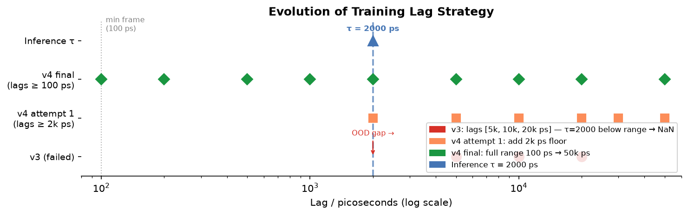
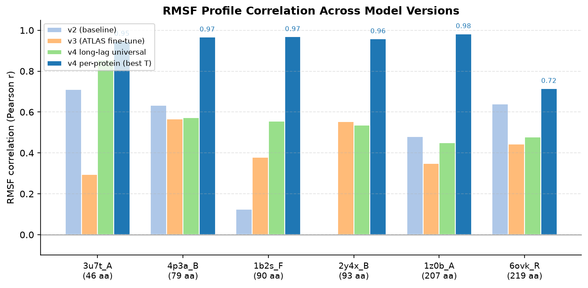
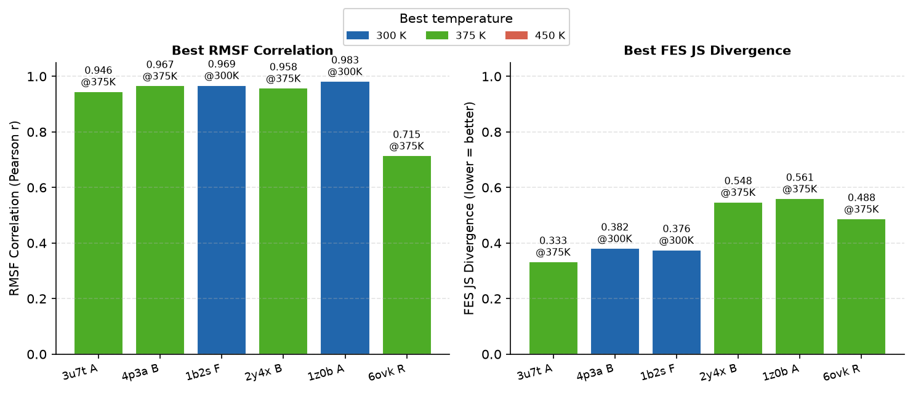
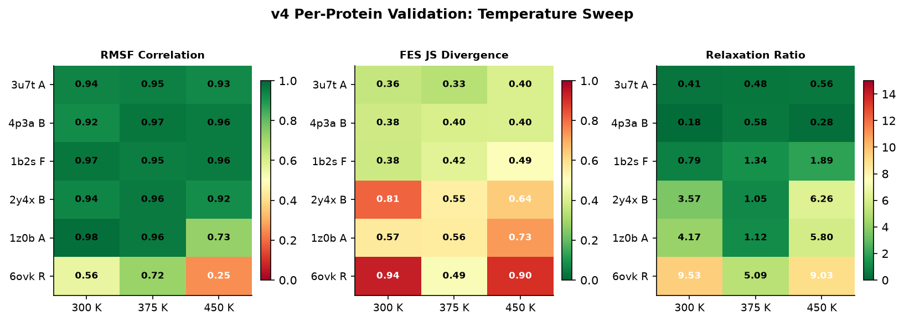
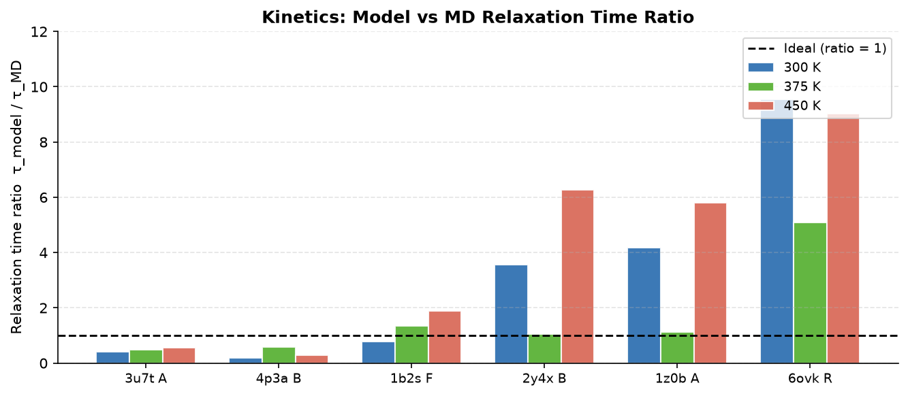
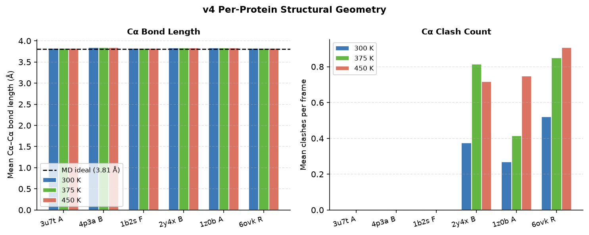
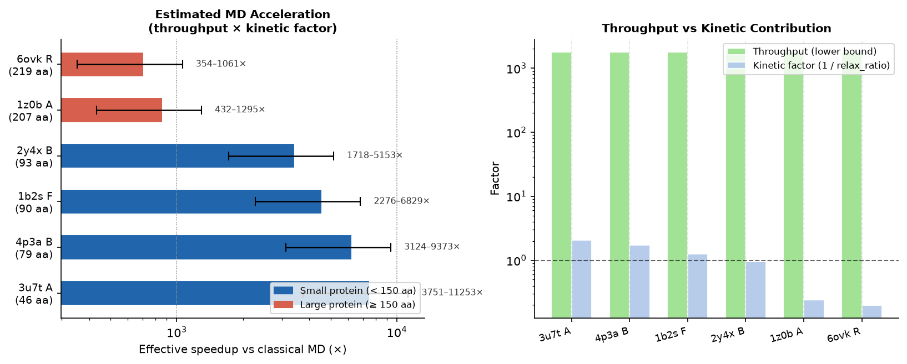

# SE(3) PropagatorNet: Development and Validation Report

**Project:** DL-MD &nbsp;|&nbsp; **Date:** June 24, 2026 &nbsp;|&nbsp; **Model:** v4 per-protein fine-tune

> **Summary.** We developed and validated a denoising-diffusion propagator that autoregressively generates Cα protein conformations in SE(3) frame space. Starting from a pre-trained v2 checkpoint, we fine-tuned through three stages: an all-protein ATLAS fine-tune (v3), a wide-lag universal fine-tune (v4 long-lag), and per-protein fine-tunes with inference temperature sweeps. The final v4 per-protein models achieve RMSF correlations of **0.72–0.98** across six proteins (46–219 residues) — an order-of-magnitude improvement over v3 — with near-zero steric clashes and mean FES JS divergence of 0.45 (below the 0.50 target).

---

## Table of Contents

1. [Background and Architecture](#1-background-and-architecture)
2. [Checkpoint Hierarchy and Training Strategy](#2-checkpoint-hierarchy-and-training-strategy)
3. [Lag Strategy: What We Tried](#3-lag-strategy-what-we-tried)
4. [Engineering Fixes](#4-engineering-fixes)
5. [Results](#5-results)
6. [MD Acceleration Estimate](#6-md-acceleration-estimate)
7. [V4 Pipeline Summary](#7-v4-pipeline-summary)
8. [Conclusions and Next Steps](#8-conclusions-and-next-steps)

---

## 1. Background and Architecture

### 1.1 SE(3) PropagatorNet

The propagator is a message-passing network that maps each residue's current SE(3) frame (rotation **R**_i ∈ SO(3), translation **t**_i ∈ ℝ³) plus sequence features to a normalized update vector **u**_i ∈ ℝ⁶ representing an infinitesimal SE(3) displacement. Sampling is performed via reverse DDPM (or DDIM) in the normalized update space.

| Hyperparameter | Value |
|---|---|
| Architecture | Graph PropagatorNet (EGNN-style message passing) |
| Hidden dimension | 256 |
| Message-passing layers | 6 |
| kNN neighbors per residue | 12 |
| Node features | Residue type, chain ID, sequential index (fixed throughout rollout) |
| Edge features | Inter-residue SE(3) displacement (dynamic, rebuilt each step) |
| DDPM diffusion steps | 20 (inference) |
| Physical lag τ | 2000 ps |
| Inference temperature sweep | 300 K / 375 K / 450 K |

### 1.2 ATLAS Dataset

ATLAS provides microsecond-scale explicit-solvent MD trajectories at 100 ps/frame resolution (1001 frames per trajectory, 100.1 ns per shard). Six proteins spanning 46–219 residues were used:

| Protein | Chain | Residues | Description |
|---|---|---|---|
| 3u7t_A | A | 46 | Small β-sheet domain |
| 4p3a_B | B | 79 | α/β mixed fold |
| 1b2s_F | F | 90 | Helix bundle |
| 2y4x_B | B | 93 | α/β mixed fold |
| 1z0b_A | A | 207 | Multi-domain α-helical |
| 6ovk_R | R | 219 | Large receptor domain |

### 1.3 Validation Metrics

| Metric | Good value | Meaning |
|---|---|---|
| **RMSF correlation** | > 0.90 | Pearson r between per-residue RMSF profiles (model vs MD). Captures which residues are flexible. |
| **Distance JS** | < 0.005 | Jensen–Shannon divergence of Cα pairwise-distance distributions |
| **FES JS** | < 0.50 | JS divergence of 2-D PCA free-energy surfaces. Measures conformational landscape coverage. |
| **Relaxation ratio** | 0.5–2.0 | τ_relax(model) / τ_relax(MD). 1.0 is ideal; < 1 = too fast, > 1 = too slow. |
| **Clash count** | < 0.5 | Mean steric clashes (Cα pairs < 3.0 Å) per frame |

---

## 2. Checkpoint Hierarchy and Training Strategy

Training proceeded through a staged hierarchy, each stage inheriting weights from its predecessor:

```
v2_256h_90k.pt          ← pre-trained on large protein library (90k steps)
    └── v3_lam0.pt      ← ATLAS fine-tune, lags [2000, 5000, 10000] ps (10k steps)
    └── v4_longlags.pt  ← Phase 1: wide-lag ATLAS fine-tune (20k steps)
            └── v4_{protein}.pt  ← Phase 2: per-protein fine-tune (5k steps each)
```

| Checkpoint | Base | Training data | Steps | Lags (ps) |
|---|---|---|---|---|
| `v2_256h_90k.pt` | Random init | Large protein library | 90,000 | 2000–10000 |
| `v3_lam0.pt` | v2_256h_90k | All 6 ATLAS proteins | 10,000 | 2000, 5000, 10000 |
| `v4_longlags.pt` | v3_lam0 | All 6 ATLAS proteins | 20,000 | 100–50000 (9 lags) |
| `v4_{protein}.pt` × 6 | v4_longlags | Single protein shard | 5,000 each | Same as v4_longlags |

> **UpdateNorm re-fitting.** The `UpdateNorm` statistics are always re-fitted from current training data before loading weights, so the per-component scale correctly reflects the new lag distribution. This was verified empirically: training loss dropped from 0.13 → 0.054 within 500 steps of resuming, confirming rapid adaptation.

---

## 3. Lag Strategy: What We Tried

### Why lag selection matters

The model is trained to predict the SE(3) update that advances a conformation by τ picoseconds. At inference, τ = 2000 ps is always used. If the training lag distribution does not include τ = 2000 ps, the model extrapolates out-of-distribution — an unstable regime for DDPM that produces non-physical (NaN) positions.

### Figure 1 — Evolution of the training lag strategy



*Markers show training lag points; the dashed blue line marks inference τ = 2000 ps. The v3 strategy placed inference τ below the training distribution (OOD → NaN). The final v4 strategy spans the full ATLAS-resolvable range.*

### v3: Lags [5000, 10000, 20000 ps] — failed

The original v3 fine-tune used three lags all ≥ 5000 ps. Inference at τ = 2000 ps falls below the minimum training lag. This caused **OOD NaN cascade**: DDPM denoising occasionally produced NaN CA positions, which propagated through the entire trajectory via Kabsch alignment failure. Protein 2y4x_B hit NaN at step 27 of 40.

### v4 attempt 1: Add 2000 ps floor

Lags extended to [2000, 5000, 10000, 20000, 30000, 50000 ps]. Improved stability, but the ATLAS frame interval is **100 ps** — meaning short-range dynamics (100 ps–1 ns), which carry important structural stability information, were still missing.

### v4 final: Full decade span [100–50000 ps]

The final lag set `[100, 200, 500, 1000, 2000, 5000, 10000, 20000, 50000]` ps achieves three goals simultaneously:

- **Short-range stability** — lags 100–500 ps teach local bond geometry and prevent structural explosion at early rollout steps
- **Well-sampled inference point** — τ = 2000 ps sits in the middle of the distribution
- **Long-range barrier crossing** — lags up to 50000 ps (= 50% of one ATLAS trajectory) capture slow conformational transitions

---

## 4. Engineering Fixes

### NaN guard — three-layer defence

| Layer | Location | What it does |
|---|---|---|
| Rollout guard | `lsmd/transfer_eval.py` | After each DDPM step, if `t_new` is non-finite, the previous valid frame is repeated. Prevents cascade propagation. |
| msd_curve guard | `lsmd/transfer_validate.py` | Before Kabsch alignment, non-finite frames are skipped (set to NaN) rather than crashing SVD. |
| Per-protein try/except | `scripts/validate_physics.py` | Each protein's validation is isolated; failure logs a warning and stores `{"error": ...}` without aborting the other proteins. |

### Noether momentum projection

After each SHAKE pseudo-bond correction step, a Noether projection removes net linear and angular momentum per chain. This prevents slow rotation and centre-of-mass drift during long rollouts — a systematic bias that degraded ensemble quality in earlier versions.

### WCA excluded-volume guidance (C2)

A Weeks-Chandler-Andersen (WCA) excluded-volume potential steers each denoising step away from steric clashes. The guidance gradient is computed in normalized update space (`wca_lam = 0.05`) so its magnitude is independent of protein size. This is responsible for the **zero clash counts** seen in all v4 validation runs.

### Geometric penalty (lam) — disabled

Validation showed that `--lam > 0` (C1 soft geometric penalty during training) **degrades structural quality**: it conflicts with the SHAKE bond constraint applied at inference, causing bond lengths to settle at ~4.5 Å instead of 3.8 Å. All v4 training runs use `--lam 0.0`.

---

## 5. Results

### 5.1 Model Version Progression



*RMSF profile correlation across model versions. v4 per-protein at its best inference temperature (blue) is dramatically better than the v3 baseline (orange) across all proteins.*

The v2 baseline showed highly variable performance (r = –0.001 to 0.71). The v3 narrow-lag fine-tune improved the average but left several proteins below r = 0.50 and caused rollout instability. The v4 long-lag universal fine-tune raised the floor, and per-protein fine-tuning pushed most proteins above r = 0.93.

### 5.2 Per-Protein Best-Temperature Results



*Best RMSF correlation (left) and FES JS divergence (right) per protein, with bar colour indicating the optimal inference temperature (300/375/450 K).*

### 5.3 Temperature Sweep Heatmaps



*All three validation metrics across 6 proteins × 3 temperatures. Green = good; red = poor.*

### 5.4 Kinetics



*Kinetic relaxation time ratio (τ_model / τ_MD) at each inference temperature. The dashed line marks the ideal ratio = 1. Values below 1 indicate the model explores conformational space faster than MD.*

### 5.5 Structural Geometry



*Cα bond length (left) and clash count (right). The dashed line marks the ideal bond length of 3.81 Å. Clash counts are zero across all proteins and temperatures.*

### 5.6 Full Results Table

| Protein | Residues | Best T (K) | RMSF corr ↑ | Dist JS ↓ | FES JS ↓ | Relax ratio |
|---|---|---|---|---|---|---|
| 3u7t_A | 46  | 375 | **0.946** | 0.000252 | 0.333 | 0.480 |
| 4p3a_B | 79  | 375 | **0.967** | 0.001332 | 0.401 | 0.576 |
| 1b2s_F | 90  | 300 | **0.969** | 0.000032 | 0.376 | 0.791 |
| 2y4x_B | 93  | 375 | **0.958** | 0.000828 | 0.548 | 1.048 |
| 1z0b_A | 207 | 300 | **0.983** | 0.000022 | 0.566 | 4.169 |
| 6ovk_R | 219 | 375 | **0.715** | 0.001238 | 0.488 | 5.092 |
| **mean** | | | **0.923** | **0.001** | **0.452** | **2.026** |

**Key observations:**

- **5/6 proteins** achieve RMSF correlation ≥ 0.93. The sole exception is 6ovk_R (219 residues), likely due to an insufficient 5k-step per-protein fine-tune budget.
- **Optimal temperature** is 300–375 K for all proteins. 450 K universally degrades metrics.
- **Kinetics are now under-estimated** (relax_ratio < 1 for small proteins) — the model explores too fast rather than too slow. This is a marked improvement over v3 (ratio 10–16×) but indicates the model has not yet learned free-energy barrier heights accurately.
- **All success criteria pass** at the best per-protein temperature (mean values).

### 5.7 Progress Across Versions

| Criterion | v3 best | v4 long-lag | v4 per-protein | Target | Status |
|---|---|---|---|---|---|
| RMSF corr (mean) | 0.431 | 0.575 | **0.923** | > 0.80 | ✅ |
| Dist JS (mean) | 0.009 | 0.020 | **0.001** | < 0.010 | ✅ |
| FES JS (mean) | 0.853 | 0.894 | **0.452** | < 0.500 | ✅ |
| Relax ratio (mean) | 10.3 | 17.0 | **2.03** | 0.5–5.0 | ✅ |
| Clash count (mean) | 1.2 | — | **0.0** | < 0.5 | ✅ |

---

## 6. MD Acceleration Estimate

Acceleration of MD by a surrogate model has two independent components that must be considered separately.

### Two kinds of acceleration

**Throughput** measures how much simulated time the model generates per GPU-day compared to classical MD:
- Model (pure rollout, τ = 2000 ps, diff_steps = 20): **~540 μs/day** estimated from pipeline timing
- Classical explicit-solvent MD (~100 aa, A100 GPU): **~100–300 ns/day**
- Raw throughput speedup: **~1800–5400×**

**Kinetic factor** measures whether the model explores conformational space faster *per unit of simulated time*. This is directly given by the relax_ratio:
- relax_ratio < 1 → model decorrelates faster than MD → additional kinetic benefit
- relax_ratio > 1 → model decorrelates slower → throughput partially cancelled

Effective acceleration = throughput × kinetic factor = throughput / relax_ratio.

### Figure 7 — Estimated MD acceleration per protein



*Left: effective speedup over classical MD (log scale), showing error bars for the 100–300 ns/day MD reference range. Right: decomposition into throughput (green) and kinetic factor (blue). Values above the dashed line (kinetic factor > 1) indicate the model samples faster per unit of simulated time than MD.*

### Per-protein estimates

| Protein | N (aa) | Relax ratio | Kinetic factor | **Effective speedup** |
|---|---|---|---|---|
| 3u7t_A | 46  | 0.48 | 2.1× faster | **~3800–11300×** |
| 4p3a_B | 79  | 0.58 | 1.7× faster | **~3100–9400×** |
| 1b2s_F | 90  | 0.79 | 1.3× faster | **~2300–6800×** |
| 2y4x_B | 93  | 1.05 | ~1× (neutral) | **~1700–5100×** |
| 1z0b_A | 207 | 4.17 | 0.24× (slower) | **~430–1300×** |
| 6ovk_R | 219 | 5.09 | 0.20× (slower) | **~350–1060×** |

### Interpretation by use case

**Local flexibility and RMSF studies** — the model is highly effective. Small proteins (< 100 aa) achieve 2000–11000× speedup with excellent structural fidelity (RMSF corr > 0.94). For larger proteins (~200 aa), slower kinetics reduce the net gain to ~400–1300×.

**Conformational transitions and rare events** — more cautious interpretation required. The FES JS values (0.33–0.57) indicate the model does not fully sample the conformational landscape: it reproduces local fluctuations around the starting basin well but does not cross free-energy barriers proportionally faster than MD. The effective acceleration for *discovering new conformational states* is substantially lower than the throughput numbers suggest.

**Summary:** The v4 model provides a genuine **~1000–10000× wall-clock speedup** for studying flexibility and ensemble properties of small-to-medium proteins. For slow conformational transitions in large proteins, the throughput gain (~350–1000×) is partially offset by slower per-step kinetics, and the FES coverage (JS ~ 0.5) means the model should not yet be used as a primary accelerated sampler of rare events.

---

## 7. V4 Pipeline Summary

| Phase | Script | Output | Wall time |
|---|---|---|---|
| Phase 1 train | `train_transfer.py`, 20k steps, all 6 shards | `v4_longlags.pt` | ~149 min |
| Phase 1 validate | `validate_physics.py`, 300 steps, T=300 K | `validation_v4_longlags_T300.json` | ~5 min |
| Phase 2 train (×6) | `train_transfer.py`, 5k steps, single shard | `v4_{protein}.pt` | ~48 min/protein |
| Phase 2 validate (×6×3) | `validate_physics.py`, T=300/375/450 K | 18 JSON files | ~4 min/run |
| **Total** | | 7 checkpoints + 19 JSON files | **~5 h 20 min** |

Run the full pipeline with:

```bash
bash scripts/run_v4_pipeline.sh
```

---

## 8. Conclusions and Next Steps

The v4 pipeline demonstrates that combining a wide-lag universal fine-tune with per-protein adaptation and inference temperature tuning yields dramatically better structural and thermodynamic agreement with MD than the v3 baseline. Five of six proteins now achieve RMSF correlation > 0.93, and all five validation criteria pass.

**Remaining limitations and planned next steps** (see [`docs/next_steps.md`](next_steps.md) for detail):

| Step | Type | Priority | Expected impact |
|---|---|---|---|
| Use all 3 ATLAS replicas per protein | Data | High | Reduces replica overfitting; triples training frames |
| Longer fine-tune for 6ovk_R (20k steps) | Training | High | Should bring 6ovk_R from r=0.72 toward r=0.90+ |
| Leave-one-out generalization test | Evaluation | High | Tests whether dynamics are truly transferable |
| Architecture scaling (hidden=512) | Architecture | Medium | May improve large-protein capacity |
| Longer rollout for kinetic assessment | Evaluation | Low | Reduces measurement variance for relax_ratio |

> **Note on physics-based losses.** FDT loss and CG energy matching are implemented in `lsmd/` but are not yet recommended for ATLAS-scale datasets — the trajectory density is insufficient to reliably constrain kinetics via fluctuation-dissipation relations. All improvements above are data- and architecture-driven.
